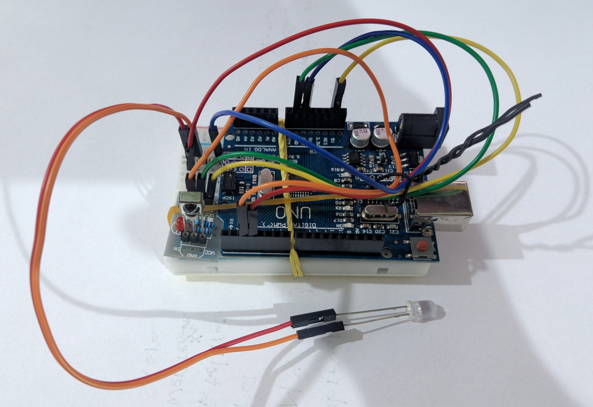

# Springer Silentia IR remote control

## Description

Project for using a arduino board as a remote control for Springer silentia air conditioner models using IRremote arduino library.

## Components

- Arduino Uno Board
- Infrared LED and resistor (connected to pin 3)
- Infrared receiver (connected to pin 2)

