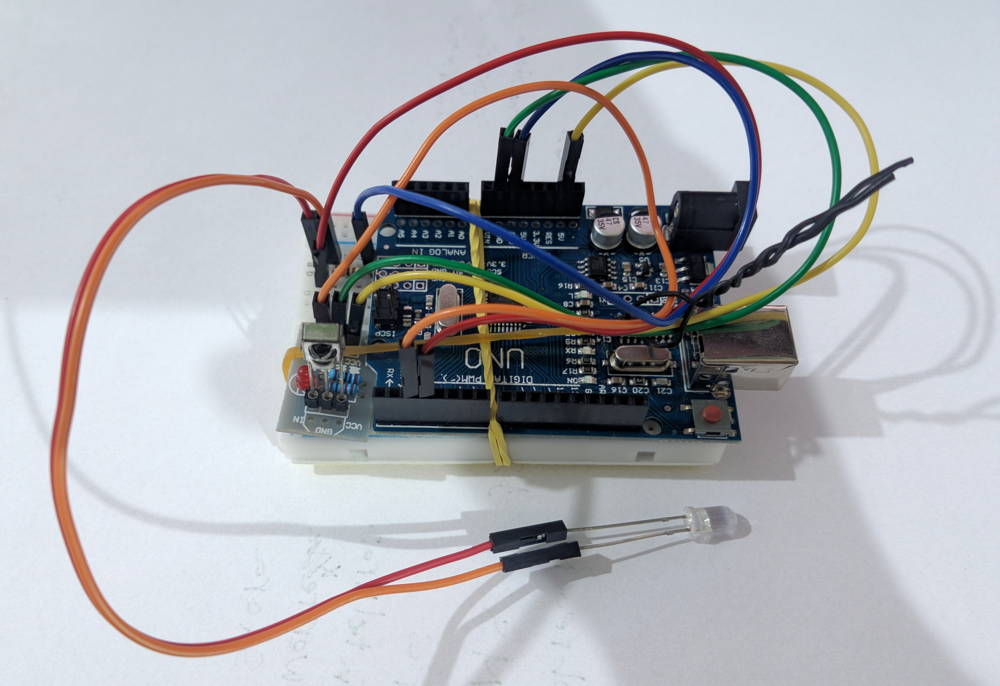

# Springer Silentia IR remote control

## Description

Project for using an Arduino board as a remote control for Springer silentia air conditioner models using [IRremote](https://github.com/Arduino-IRremote/Arduino-IRremote) Arduino library.

## Components

- Arduino Uno Board
- Infrared LED and resistor (connected to pin 3)
- Infrared receiver (connected to pin 2)

## How it works

It works by periodically sending a pulse width signal stored in its memory. The signal sent can be changed by using a NEC protocol IR remote to map signals from the original springer remote to new NEC commands. The functions are mapped as follows:

## Libraries used
[IRremote](https://github.com/Arduino-IRremote/Arduino-IRremote)
